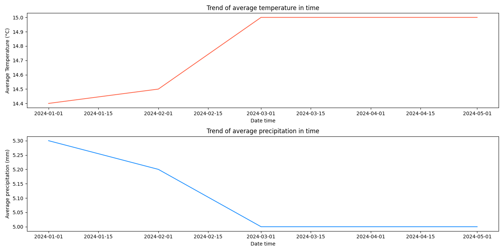
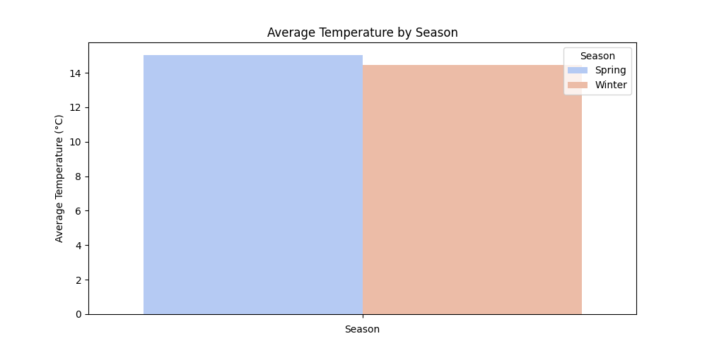
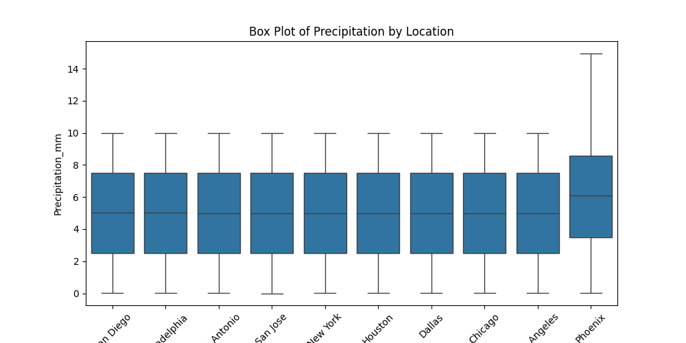
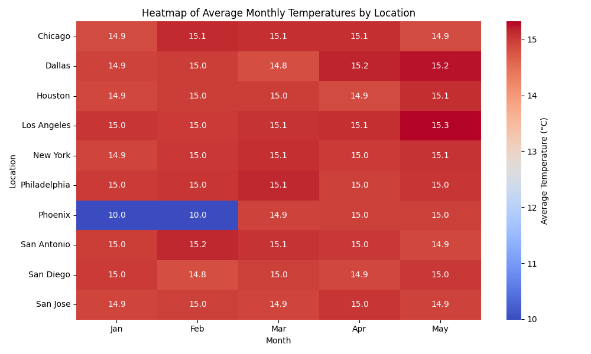
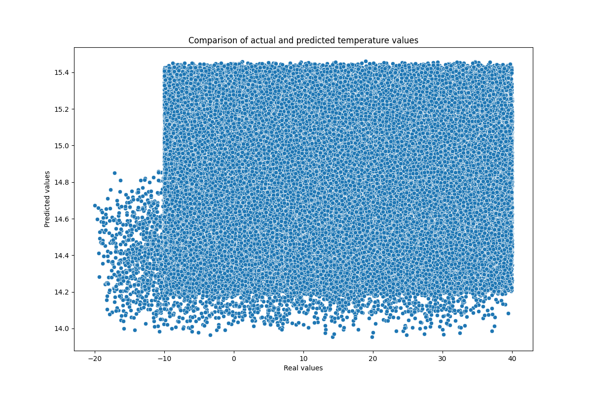

# *UPDATED*: Weather Data Analysis with Pandas, Matplotlib, and Predictive Modeling

This project performs comprehensive analysis and visualization of weather data using Pandas, Matplotlib, Seaborn, and now includes a predictive model for temperature forecasting. The code is organized into separate modules for trend analysis, seasonality visualization, location comparison, and temperature prediction.

## Table of Contents

- [Project Overview](#project-overview)
- [Technologies Used](#technologies-used)
- [File Structure](#file-structure)
- [Usage](#usage)
- [Functionality](#functionality)
- [Future Enhancements](#future-enhancements)

## Project Overview

This project analyzes weather data from a CSV file, providing insights into trends in temperature and precipitation over time, seasonal patterns, and comparisons across different weather locations. Additionally, a predictive model estimates future temperature based on various weather parameters.

https://www.kaggle.com/datasets/prasad22/weather-data?resource=download

## Technologies Used

- Python 3.x
- Pandas
- Matplotlib
- Seaborn
- Scikit-learn

## File Structure
```
weather_analysis/
├── analyses/
│   ├── compare_weather_locations.py             
│   ├── seasonality_analysis.py        
│   ├── trend_analysis.py   
│   └── predictive_model.py
├── data/
│   └── weather_data.csv 
├── png/
│   └── comparison_of_actual_and_predicted_temp.png
├── LICENSE         
├── main.py                           
└── README.md
```

## Usage

1. Clone the repository:
   ```bash
   git clone https://github.com/kamil7133/Weather_Data_Analysis_with_Pandas_Matplotlib_and_Seaborn
   ```
2. Navigate to the project directory:
   ```bash
   cd Weather_Data_Analysis_with_Pandas_Matplotlib_and_Seaborn
   ```
3. Ensure you have all the necessary libraries installed:
   ```bash
   pip install pandas matplotlib seaborn scikit-learn
   ```
4. Run the main script:
   ```bash
   python main.py
   ```

## Functionality

### `main.py `
The entry point of the program that imports and runs analysis functions:

- `plot_trend_analysis`: Analyzes and visualizes trends in average temperature and precipitation over time.
- `plot_seasonal_variation`: Visualizes seasonal variations in temperature and precipitation.
- `plot_location_comparison`: Compares weather metrics across different locations using heatmaps.
- `train_and_evaluate_model`: Trains a predictive model for temperature forecasting and evaluates its performance.

### `trend_analysis.py`
Contains the `plot_trend_analysis` function, which:
- Processes the weather data to extract yearly and monthly averages.
- Generates line plots for average temperature and precipitation trends over time.


### `seasonality_visualization.py`
Defines the `plot_seasonal_variation` function, which:
- Calculates average temperature and precipitation by season.
- Creates bar plots and box plots to visualize seasonal data.



### `compare_weather_locations.py`
Includes the `plot_location_comparison` function, which:
- Aggregates weather data by location and month.
- Generates a heatmap to compare average monthly temperatures across different locations.


### `predictive_model.py`
Contains the `train_and_evaluate_model` function, which:
- Uses weather parameters like humidity, precipitation, and wind speed to predict temperature.
- Trains a regression model using Scikit-learn.
- Visualizes the comparison of actual and predicted temperatures.


## Future Enhancements
- Additional Metrics: Include analysis for other weather parameters, such as humidity and wind speed.
- Advanced Models: Experiment with more sophisticated machine learning models for prediction.

## Contributing
- Contributions are welcome! If you have suggestions for improvements or new features, please open an issue or submit a pull request.
